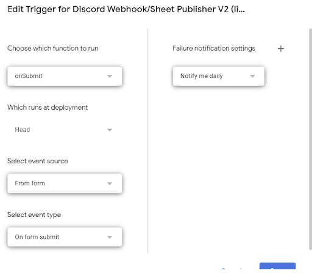

# RAS Orders Automation (Google Apps Script)

## Accessing the Google Script

To access the Google Script code:
- Go to the Google Form and click the 3 vertical dots menu in the top right → **Script Editor**.  
- You will then see an IDE.  

If you hover over the left menu, you will see the following items:

- **Editor**  
  - IDE for writing scripts  

- **Triggers**  
  - Each trigger defines when a specified function executes  
  - The function trigger for the main script should be defined as follows:  
<table>
  <tr>
    <td></td>
  </tr>
  <tr>
    <td colspan="1" align="center">
      <em><b></b> GAS Trigger Config</em>
    </td>
  </tr>
</table>  
- **Executions**  
  - History log of all script executions (fail/complete)  
  - This is where `Logger.log()` messages show when you click on a particular execution  

- **Project Settings**  
  - Important for enabling access to `appsscript.json` from the Editor  
  - `appsscript.json` is crucial for script permission enabling  

---

## The Script Code

Most of the code is self explanatory, so this section will only touch on some necessities (most important being where to find specific pieces of data) and general tips  

### Overview
The Google Script Project is heavily based on the script in this repository:  
👉 https://github.com/Iku/Google-Forms-to-Discord  

Our version builds on this repository by adding features like…  
- Creating a new spreadsheet with Google Form content for individual non-Amazon orders  
- Generating a prefilled ESL form  
- Allows user input to be a spreadsheet instead of a million question form  
- Importing the data into our master budget sheet  
- Various customizations to the Discord embed (i.e. thumbnail, custom messages, embed color, auto-pinging, etc)  
- …and much more! Hooray 😀🥳🎉🎈  

## Important Tips
- Source control/version history is a huge pain by default because Apps Script doesn’t natively support git/easy source control  
    - 👉 https://github.com/google/clasp  
    - This lets you pull and push from your Apps Script workspace / local files  
    - I highly recommend you **ONLY pull from the Apps Script** workspace and push to GitHub from your local  
    - Pushing to Apps Scripts is dangerous because it irreversibly overwrites all the content there  
- Each `.gs` file represents a module in the system (i.e. `Discord.gs` has code for publishing data to Discord)  
    - Each file should have a single function at the top to be called by `Main.gs` (i.e. `ESLForm.gs` has `getESLForm()`)  
    - `Discord.gs` is only exception since it has another function (`killProcess()`) that should run when an error occurs  
- Make sure to SAVE before expecting changes in script behavior (`CTRL + S`)  
- `mainOnSubmit()` in `Main.gs` runs on form submission  
- `CTRL + R` is very useful for prototyping because you don’t have to submit the form to run your code  

---

# Creating/Editing/Reading Google Sheets
- There are a few permissions required to programmatically create, edit, and read Google Sheets  
  - These permissions can be found in `appsscript.json`  
  - View of this file is disabled by default, so you need to enable it in the settings as detailed in section above  
  - After editing the permissions in `appsscript.json`, make sure to run (`CTRL+R`) your code and follow the popup dialog to refresh the permissions  

- `folderID` (in `CreateSheet.gs`’s `createSheet()`) specifies what folder to place the new sheet in  
  - Can be found at the end of a Google Drive URL  

- `sheetID` (in `EditMasterSheet.gs`’s `editMasterSheet()` function) specifies which Google Sheet to append data to and is retrieved from the Google Sheet URL  
  - `sheetID` is found between `/d/` and `/edit`.  

- `inputSheetID` (in `ReadInputSheet.gs`’s `readSheet()`) gets read by parsing the Google Form’s answer to the file upload question  

---

